# 🖼️ FoamV2 功能截图预览

[← 返回项目介绍](../README.md) · [📦 查看部署教程](DEPLOYMENT.md) · [💬 Telegram 群组](https://t.me/FoamHub)

以下截图来自 FoamV2 Web 端实际界面，演示数据均为测试内容。界面和功能可能随版本更新略有调整。

## 🔐 登录与账号入口

支持账号密码登录、Telegram 登录、卡密激活、用户注册、邀请码注册及初始化管理员等入口。

[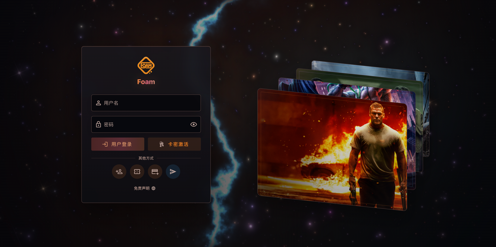](../imgs/screenshots/1.png)

## 🤖 首页

媒体库统计、正在播放、最新入库。

[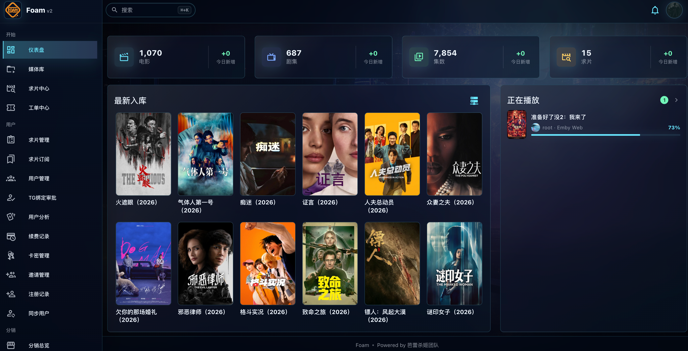](../imgs/screenshots/2.png)

## 🤖 媒体库

媒体库信息、画质音质、入库状态

[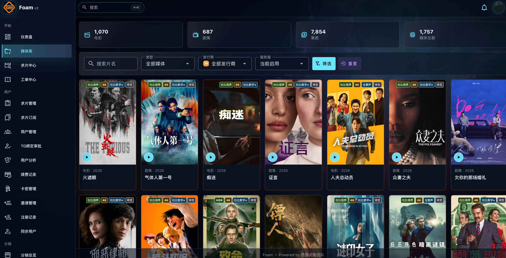](../imgs/screenshots/3.png)

## 🤖 求片信息

提交人、提交媒体信息、包括具体到哪季

[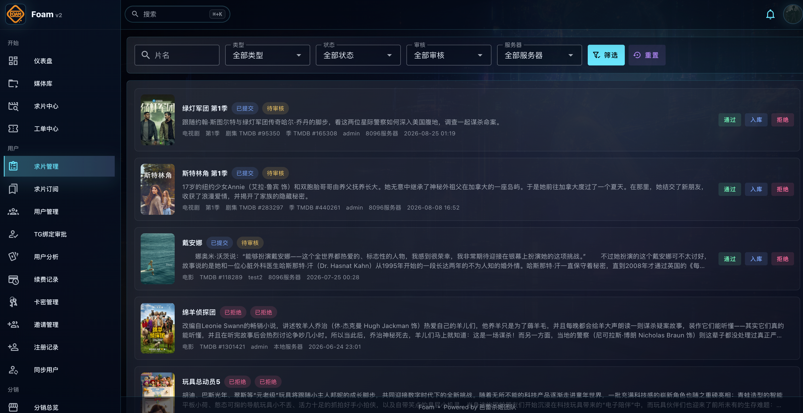](../imgs/screenshots/4.png)

## 🤖 卡密管理

开号、根据多emby选择开号、开号明细

[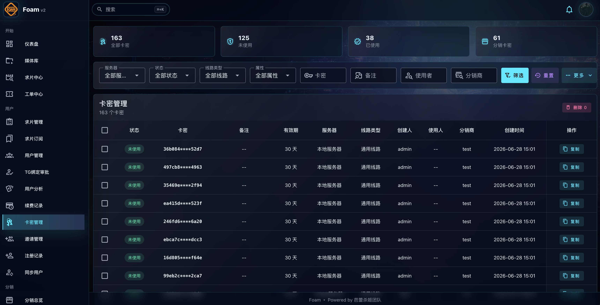](../imgs/screenshots/5.png)

## 🤖 追新日历

可以查看每天更新的影片和剧集

[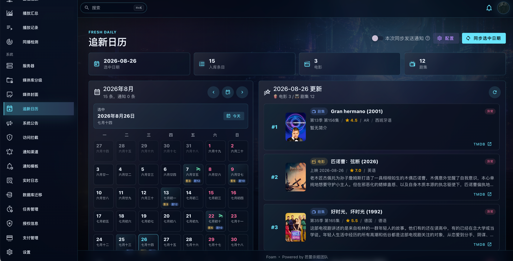](../imgs/screenshots/6.png)

## 🤖 访问拦截

提供UA、地区拦截、拦截记录

[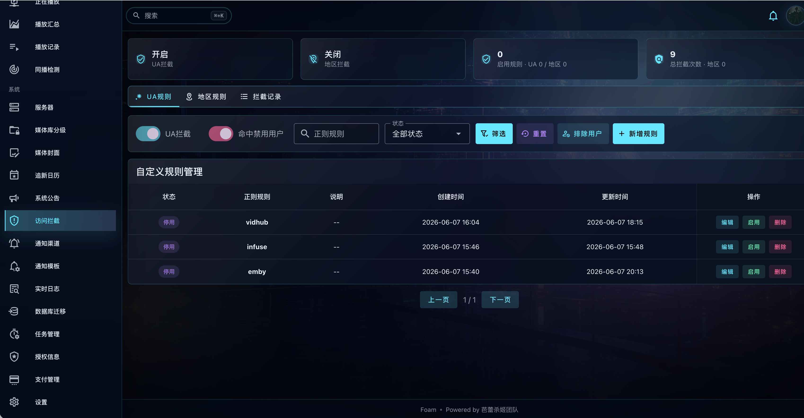](../imgs/screenshots/7.png)
[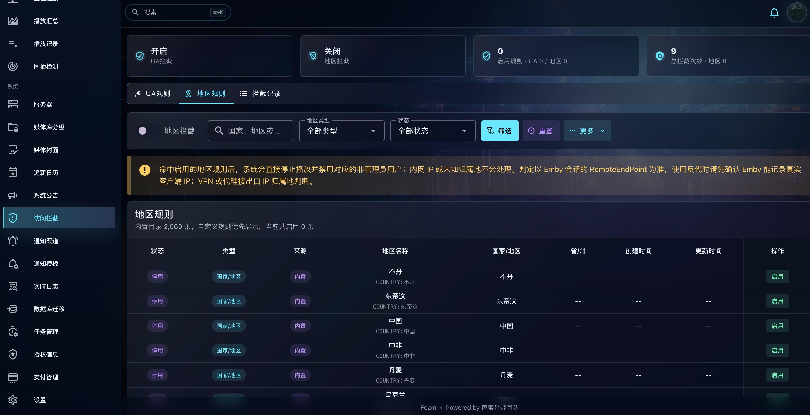](../imgs/screenshots/8.png)
[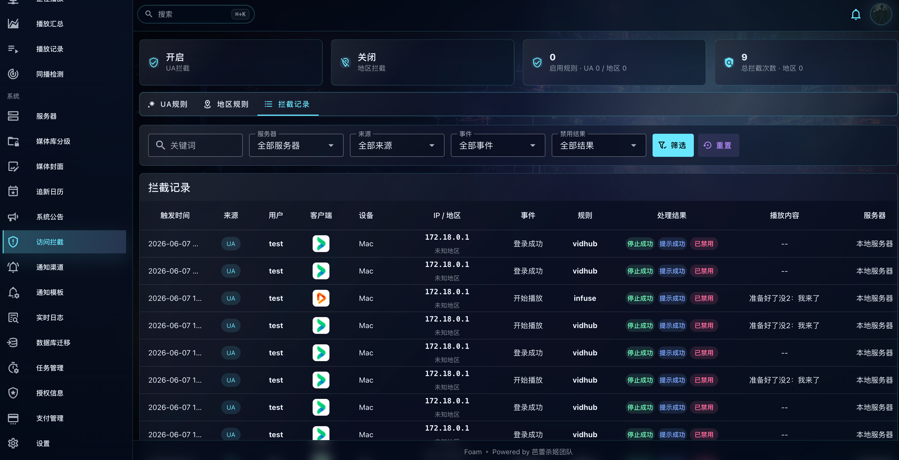](../imgs/screenshots/9.png)

## 🤖 支付框架

系统提供对接聚合支付的公共接口、不提供支付账号登任何信息、用户自行对接、以下是模拟数据、请供参考、并非真实数据

[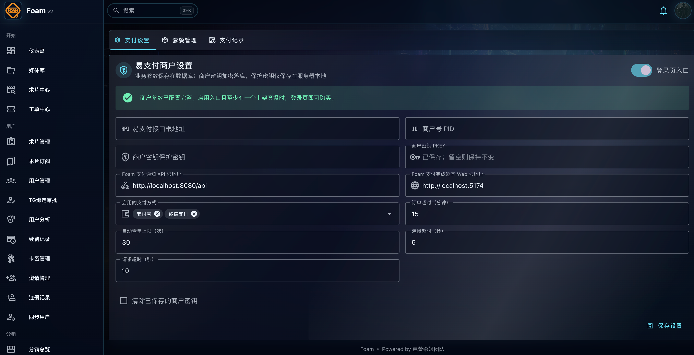](../imgs/screenshots/10.png)
[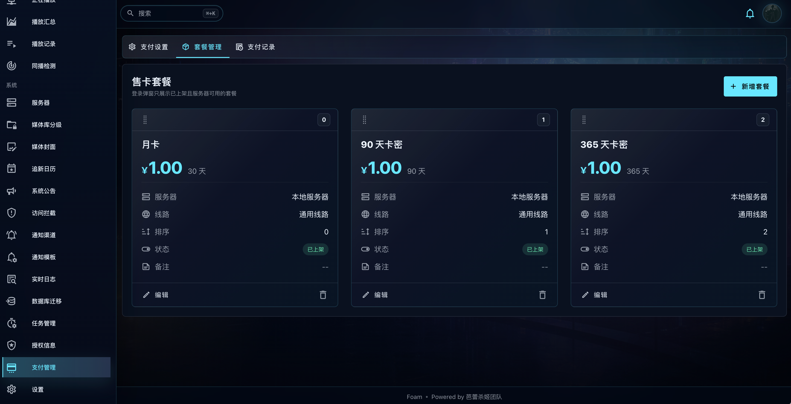](../imgs/screenshots/11.png)
[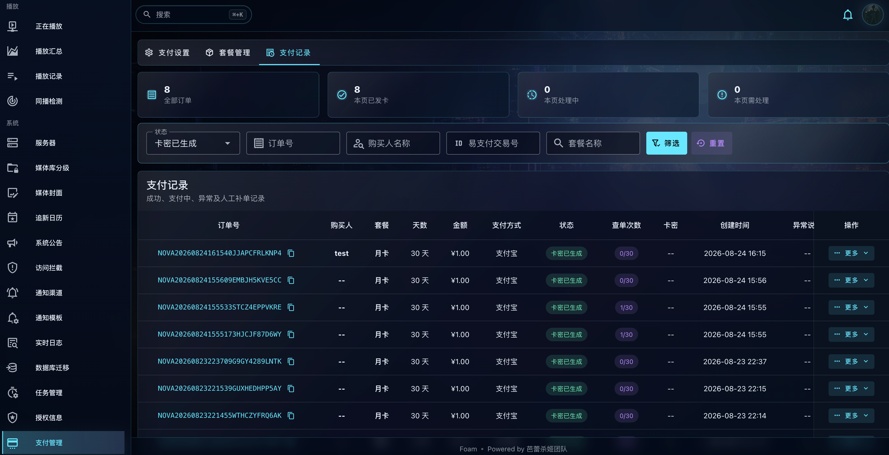](../imgs/screenshots/12.png)

## 🤖 Telegram通知

入库、播放、求片通知

[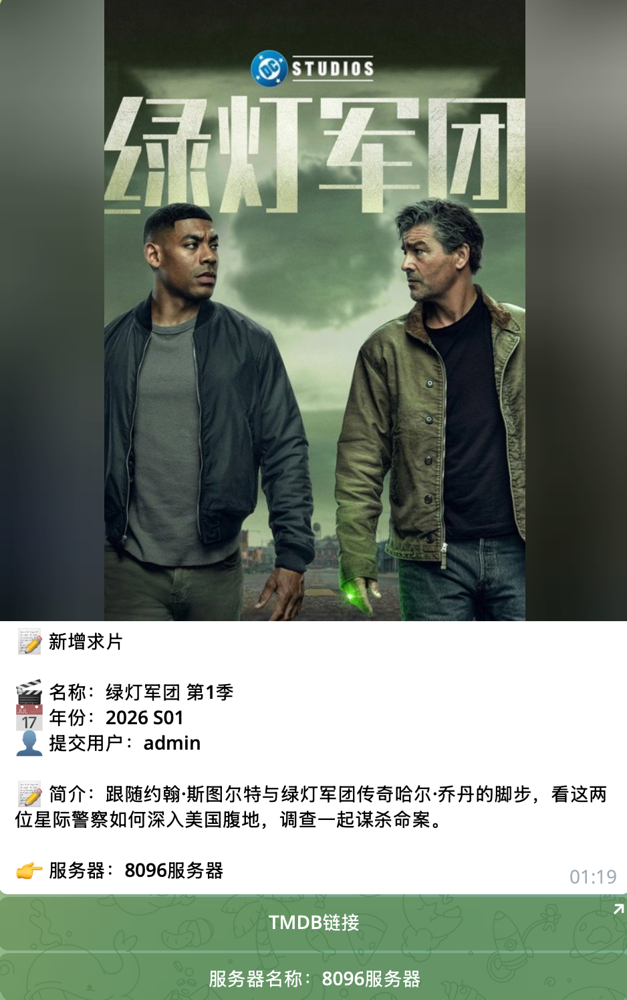](../imgs/screenshots/14.png)
[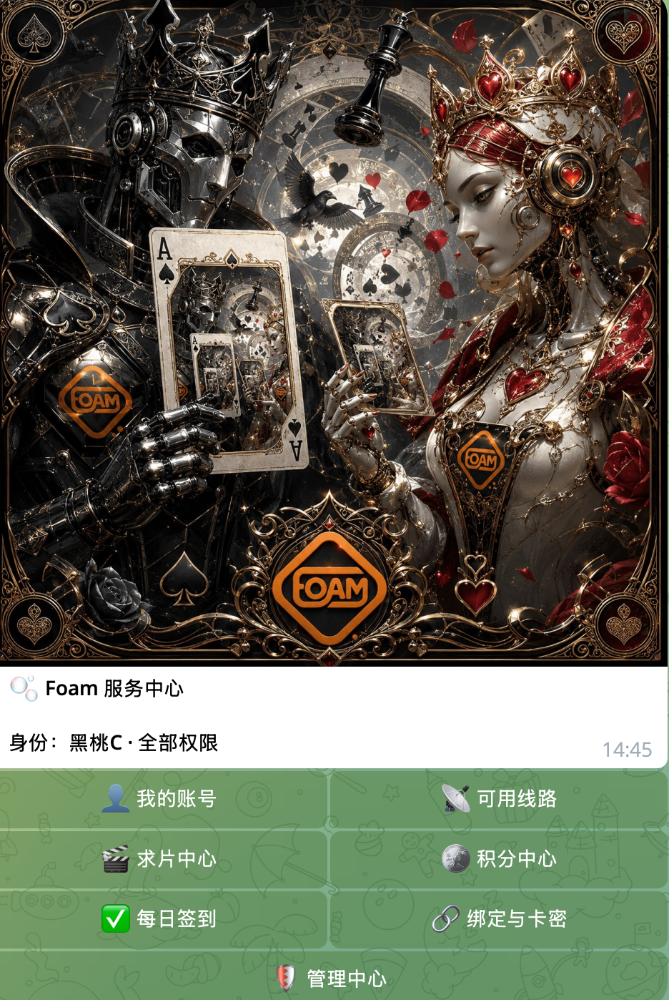](../imgs/screenshots/15.png)
[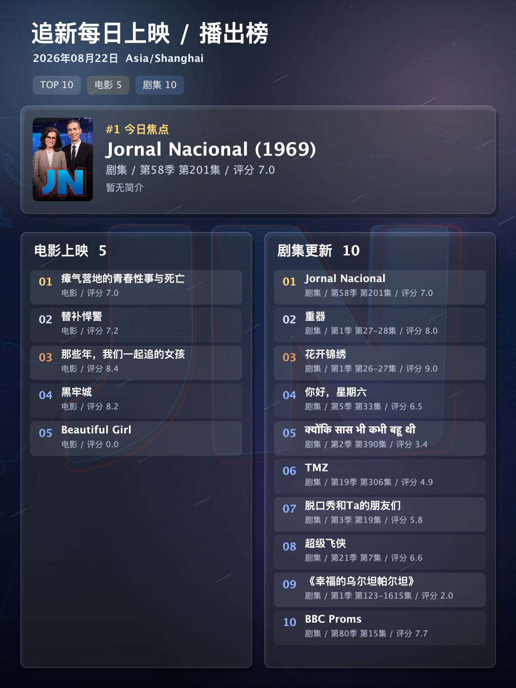](../imgs/screenshots/16.jpg)
[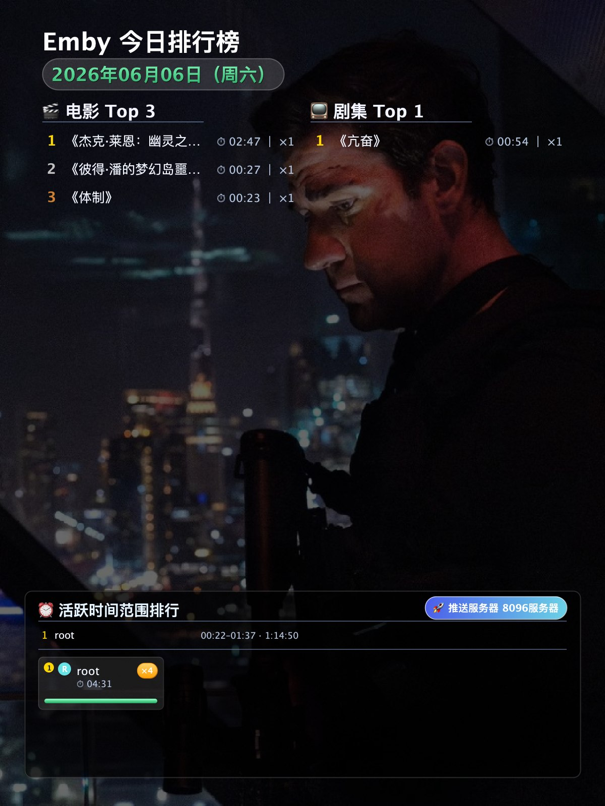](../imgs/screenshots/17.jpg)
[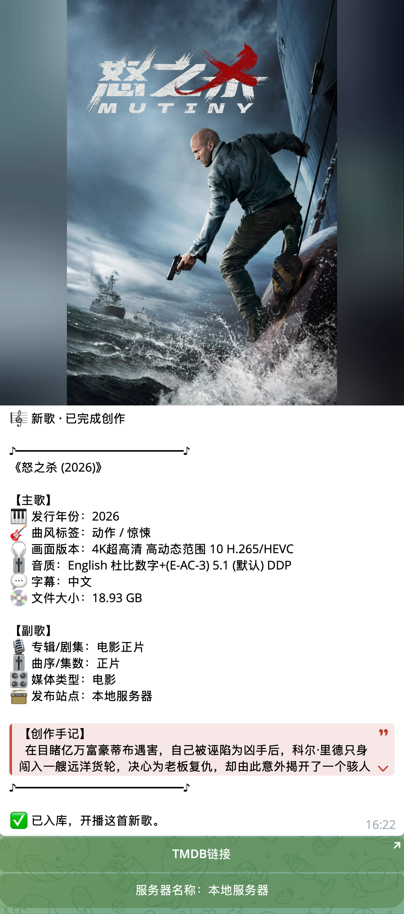](../imgs/screenshots/18.png)

## 📢 更多精彩

功能实在太丰富了、等你来发现、GL

---

[← 返回项目介绍](../README.md) · [📦 查看部署教程](DEPLOYMENT.md)
